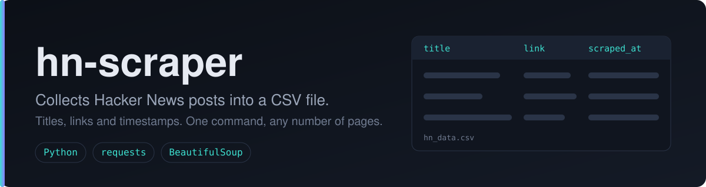
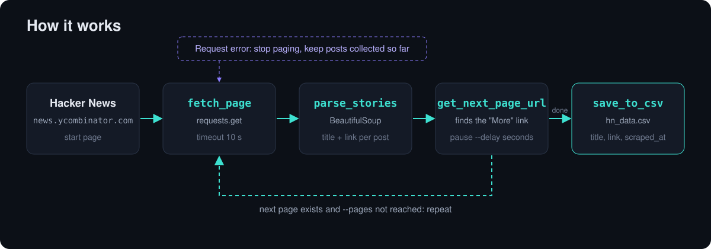

  

# hn-scraper

A small Python script that collects post titles and links from the [Hacker News](https://news.ycombinator.com/) front page and saves them to a CSV file. It follows the "More" link, so you can collect several pages in one run.

## What it does

- Downloads Hacker News pages with `requests` (10 second timeout, custom User-Agent)
- Parses posts with `BeautifulSoup`: title and link for each one
- Resolves relative links (for example Ask HN posts) to full URLs
- Follows the "More" link to the next page, with a pause between requests
- Saves the result to a CSV file with the columns `title`, `link`, `scraped_at` (UTC timestamp)

## How it works

If a request fails, the script stops paging and saves the posts collected up to that point. If nothing was collected, it exits with an error.

## Install

    git clone https://github.com/vantacorehq/hn-scraper.git
    cd hn-scraper
    pip install -r requirements.txt

## Usage

    python scraper.py
    python scraper.py --pages 3 --output hn_data.csv

| Option | Default | Description |
| --- | --- | --- |
| `--pages` | `1` | How many pages to collect |
| `--output` | `hn_data.csv` | Output CSV file name |
| `--delay` | `1.0` | Pause between page requests, in seconds |

## Example output

The picture shows made-up example data. A real run saves the actual posts. A sample file is in [`sample_output.csv`](sample_output.csv).

## Project files

| File | Purpose |
| --- | --- |
| `scraper.py` | The scraper |
| `requirements.txt` | Dependencies: `requests`, `beautifulsoup4` |
| `sample_output.csv` | Sample of the output format |
| `assets/` | Images used in this README |

## Limitations

- Works only with the Hacker News front page layout.
- No automatic retries: a failed request ends the run.
- Output format is CSV only.

## Need a custom scraper?

Open for freelance work: scraping and automation projects. DM me on X: [@vantacorehq](https://x.com/vantacorehq)

